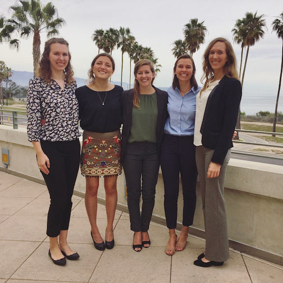

```{r setup, include=FALSE}
knitr::opts_chunk$set(echo = TRUE)
library(htmltools)
```

## About the team

We are a group of masters students ([team 'ResilienSeas'](https://resilienseas.weebly.com/)) at the Bren School of Environmental Science & Management at University of California, Santa Barbara. Over the past year and a half we have been working with our client, the West Coast Ocean Data Portal and partners at the West Coast Regional Planning Body to identify gaps in ocean acidification monitoring and hotspots throughout the California Current System.



  
  
## About the client
The [West Coast Ocean Data Portal](http://portal.westcoastoceans.org/) is a project of the West Coast Governors Alliance on Ocean Health (WCGA) to increase discovery and connectivity of ocean and coastal data and people to better inform regional resource management, policy development, and ocean planning. The Portal informs priority West Coast ocean issues such as tracking sources and patterns of marine debris, adaptation to sea-level rise, understanding impacts of ocean acidification on our coasts, and marine planning. 

The Portal links existing data systems together to provide an easy to use gateway to discover ocean and coastal data. Coastal decision-makers, researchers, and stakeholders use the Portal to access data and decision-support tools they need to understand and address high-priority regional issues. The Portal is funded through NOAA's Regional Ocean Partnership grant and includes tools to help coastal managers track marine debris to help prioritize clean ups and advocate for policies to reduce the impact of trash on our beaches.

Established in 2015, the [West Coast Regional Planning Body](http://www.westcoastmarineplanning.org/) (RPB) is a partnership between federally-recognized tribes, federal government agencies, and the states of Washington, Oregon and California focused on enhanced coordination and communication around planning and management of current and emerging ocean uses, as well as information and data-sharing on the West Coast of the U.S.
  
  
## About the Bren School
The [Bren School of Environmental Science & Management](http://www.bren.ucsb.edu/) at UCSB has earned a reputation as one of the top schools of its kind in the nation. It is among a handful of schools in the United States — and the only one in the West — that integrate science, management, law, economics, and policy as part of an interdisciplinary approach to environmental problem-solving. 
